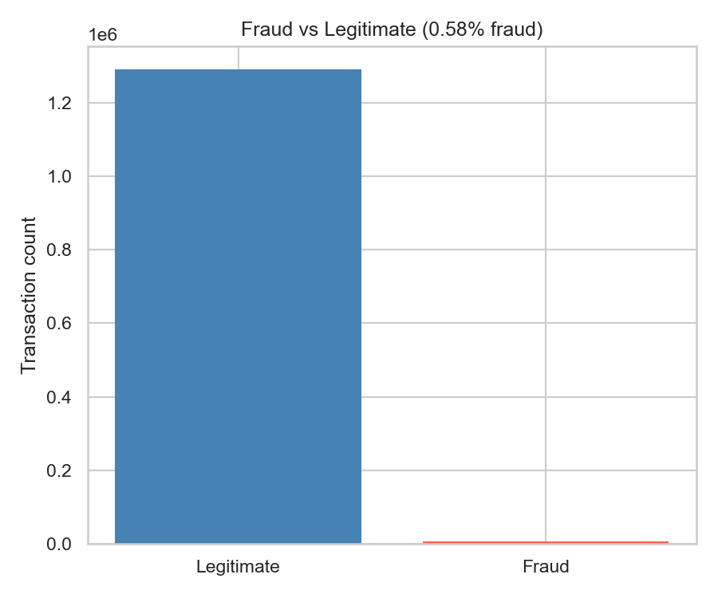
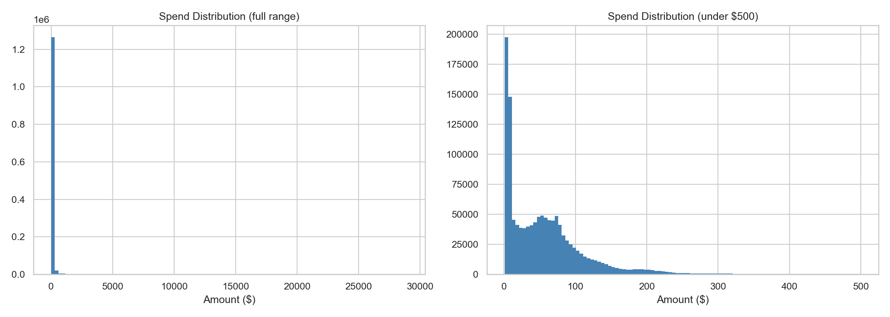
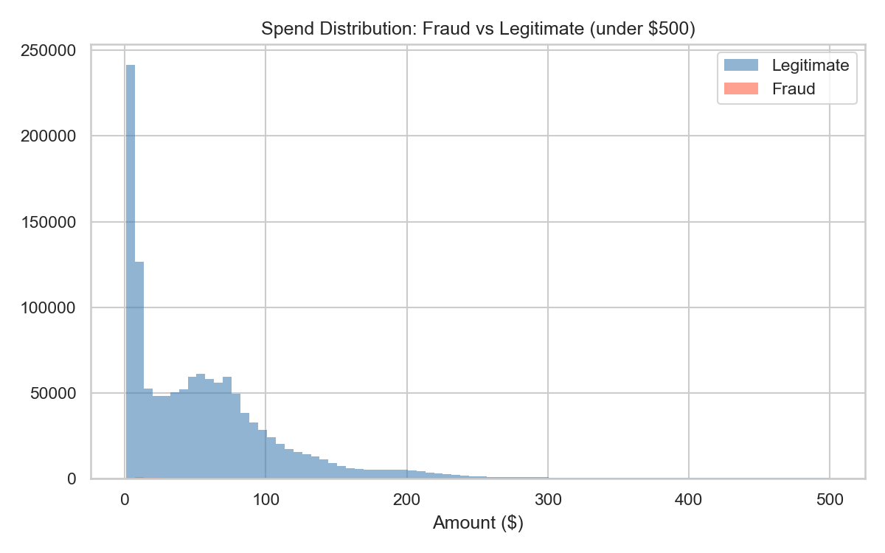
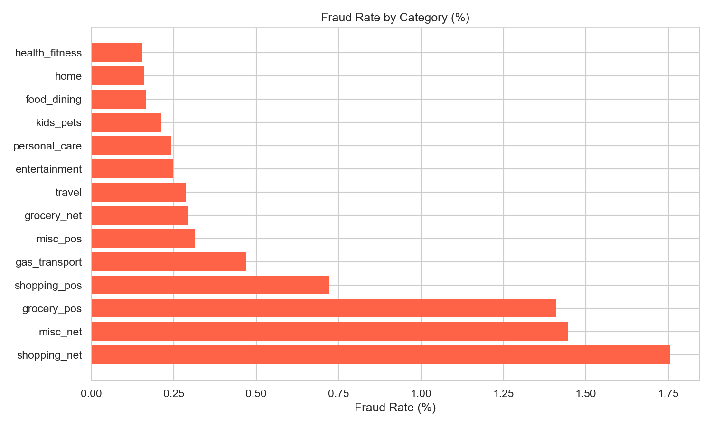
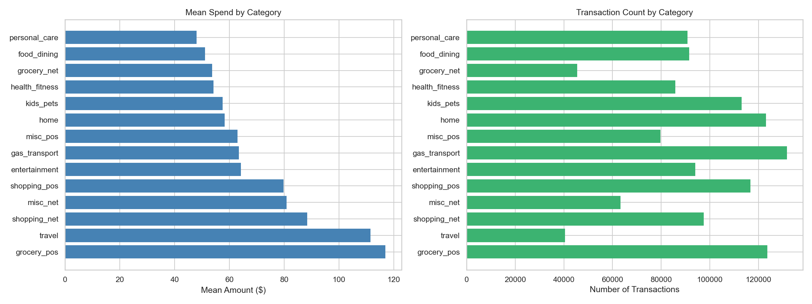
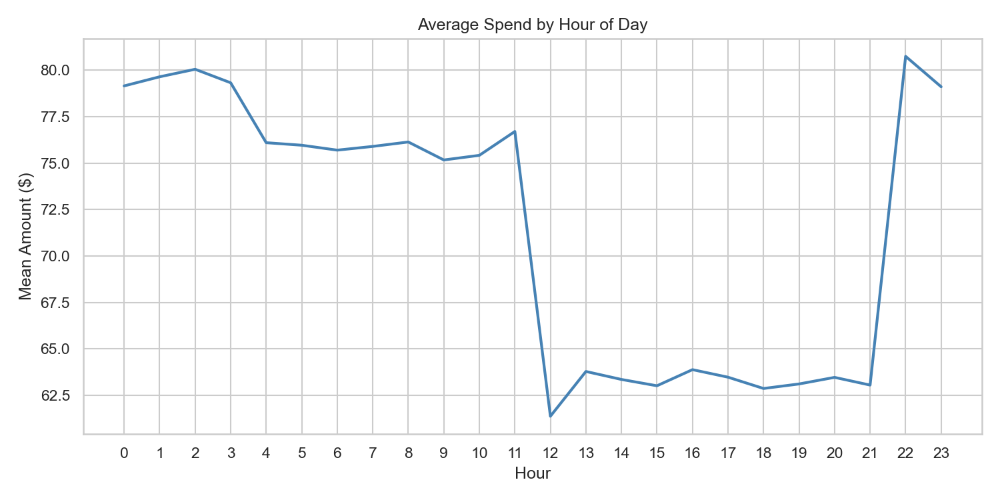
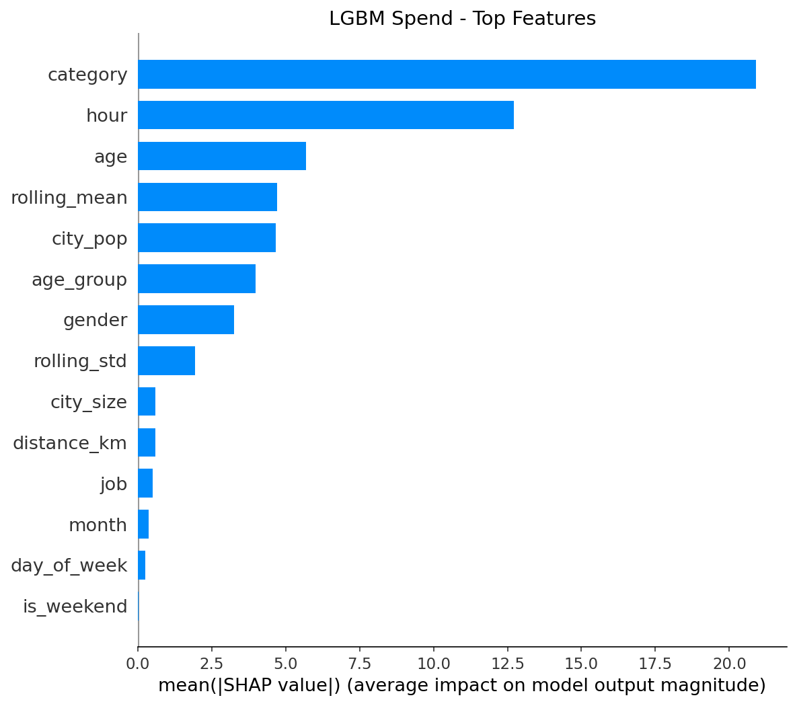
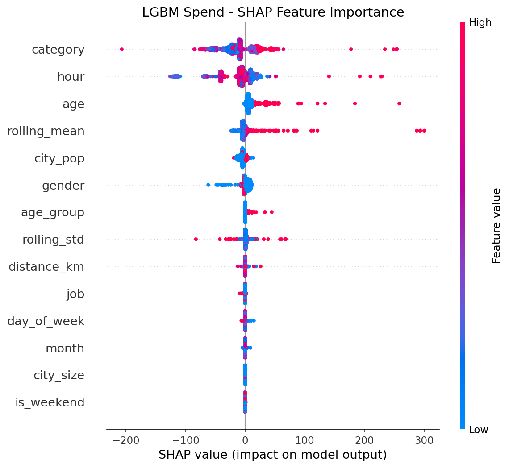
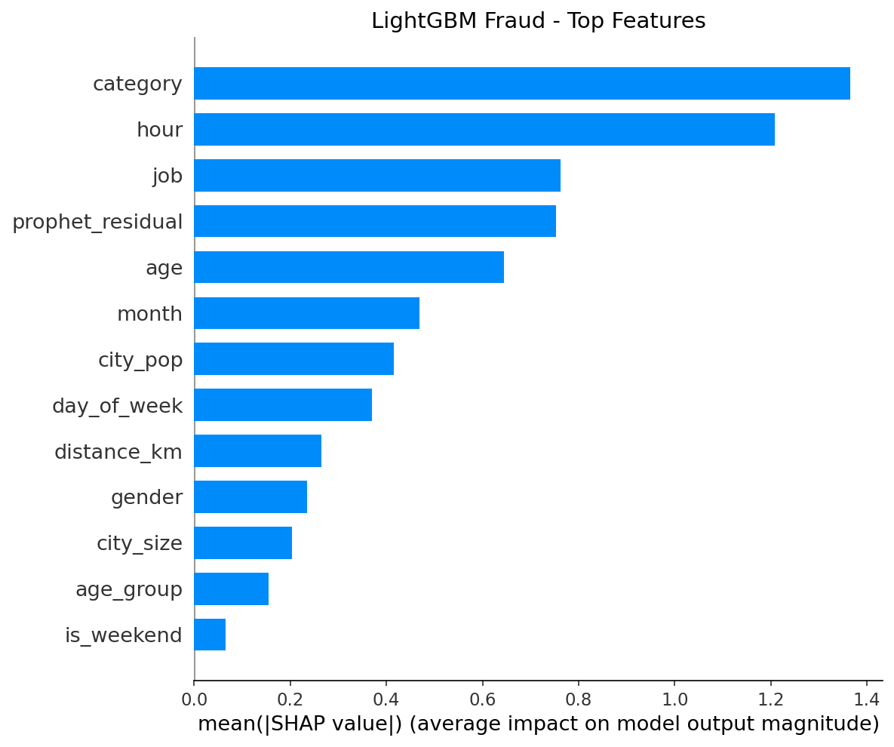
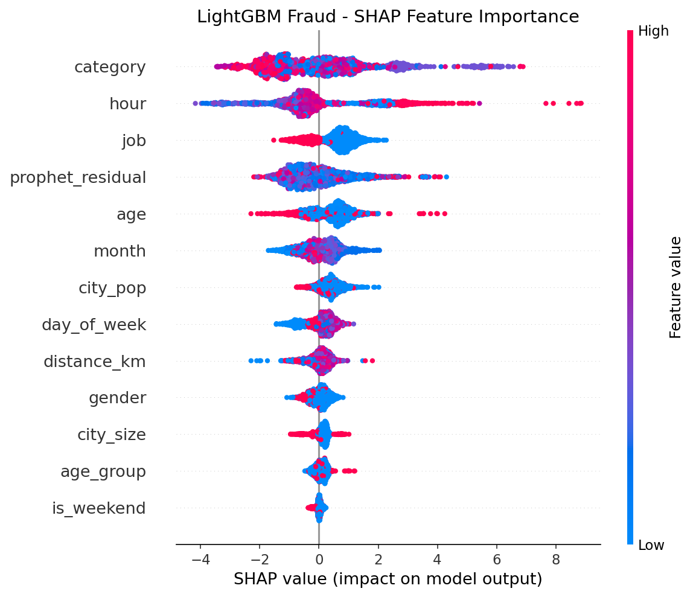

# Credit Fraud & Spend Intelligence

**What behavioral and demographic patterns predict high spending, and do fraudulent transactions mimic those same patterns or have clearly different signatures?**

An end-to-end machine learning project that answers that question through leakage-free feature engineering, rolling z-score anomaly detection, gradient boosting models, deep learning baselines, Optuna hyperparameter optimization, and SHAP-based interpretability. Approximately 1.3 million credit card transactions are analyzed to model spending patterns and detect fraud with production-ready code.

Dataset sourced from Kaggle: ["Credit Card Transactions Dataset"](https://www.kaggle.com/datasets/priyamchoksi/credit-card-transactions-dataset) by priyamchoksi.

---

## Dataset Overview

### Data Description

The dataset contains 1,296,675 credit card transactions spanning from January 2019 onwards. Each transaction record includes:

**Transaction Details:**
- Transaction timestamp and date
- Transaction amount (ranging from $0.01 to $30,000+)
- Merchant category (15 categories including grocery, shopping, gas transport, entertainment)
- Fraud label (binary: is_fraud)

**Cardholder Information:**
- Demographics: age, gender, occupation
- Location: city, state, zip code, population
- Date of birth

**Geographic Data:**
- Cardholder coordinates (lat, long)
- Merchant coordinates (merch_lat, merch_long)
- Distance calculations between cardholder and merchant locations

### Class Distribution



The dataset exhibits severe class imbalance typical of fraud detection scenarios:
- **Legitimate transactions:** 1,289,193 (99.42%)
- **Fraudulent transactions:** 7,482 (0.58%)

This 172:1 imbalance ratio necessitates specialized handling through techniques like scale_pos_weight optimization rather than naive classification approaches.

---

## Exploratory Data Analysis

### Transaction Amount Distribution



Transaction amounts exhibit a heavily right-skewed distribution:
- **Median transaction:** ~$40
- **Mean transaction:** ~$75
- **Majority of transactions:** Under $100 (85% of dataset)
- **Long tail:** Transactions above $500 represent less than 2% of total volume

The distribution shows distinct peaks around common price points ($5, $10, $25, $50), reflecting typical retail pricing strategies.

### Fraudulent Transaction Patterns



Fraudulent transactions display a distinct spending pattern compared to legitimate transactions:
- **Small test transactions:** Peak near $0-$10 (card testing behavior)
- **Medium fraud:** Cluster around $300-$400 (below typical alert thresholds)
- **Large fraud:** Distributed across $700-$1,200 range
- **Avoidance pattern:** Noticeable dip around $100-$200, suggesting fraudsters avoid common price points that might trigger scrutiny

### Merchant Category Analysis




**Fraud Rate by Category:**
- **Highest risk:** shopping_net (1.75%), misc_net (1.45%), grocery_pos (1.42%)
- **Lowest risk:** health_fitness (0.15%), home (0.16%), food_dining (0.17%)
- **Key insight:** Online/remote transactions (net suffix) show 5-10x higher fraud rates than in-person (pos) transactions

**Average Spend by Category:**
- **Highest spend:** grocery_pos ($117), travel ($112), shopping_net ($88)
- **Lowest spend:** personal_care ($47), food_dining ($51), grocery_net ($54)
- **Volume leaders:** gas_transport (132K transactions), grocery_pos (124K), home (123K)

### Temporal Patterns



Transaction amounts vary significantly by hour of day:
- **Peak spending hours:** 22:00-23:00 ($80+ average) and 0:00-3:00 ($78-80 average)
- **Lowest spending:** 12:00 noon ($61 average)
- **Business hours pattern:** Relatively stable $75-77 range during 4:00-11:00 and 13:00-21:00
- **Late night anomaly:** Sharp spike at 22:00 suggests different spending behavior (possibly entertainment, emergencies, or fraud)

The noon dip likely reflects lunch-time micro-transactions, while late evening peaks may indicate larger purchases made after work hours or automated recurring billing cycles.

---

## Predictive Models

### Spend Prediction Models

**Objective:** Predict the transaction amount (continuous regression task)

**Models Evaluated:**
1. **LightGBM Regressor** - Gradient boosting framework using tree-based learners
2. **XGBoost Regressor** - Optimized gradient boosting library
3. **MLP (Multi-Layer Perceptron)** - Feedforward neural network with PyTorch
4. **LSTM (Long Short-Term Memory)** - Recurrent neural network for sequential patterns

**Target Variable:** `amt` (transaction amount in dollars)

**Evaluation Metric:** RMSE (Root Mean Squared Error) - penalizes large prediction errors

**Key Features:** rolling_mean, rolling_std, category, hour, age, city_pop, and other demographic/transaction features

---

### Fraud Detection Model

**Objective:** Classify transactions as fraudulent or legitimate (binary classification task)

**Model Used:**
- **LightGBM Classifier** - Gradient boosting framework optimized for speed and performance

**Target Variable:** `is_fraud` (binary: 0 = legitimate, 1 = fraudulent)

**Evaluation Metric:** F1 Score - balances precision and recall, critical for imbalanced fraud detection

**Key Challenge:** Severe class imbalance (0.58% fraud rate) addressed through scale_pos_weight optimization

**Key Features:** rolling_zscore (anomaly detection), category, hour, job, and behavioral pattern features

**Why Different Models for Each Task:**
- Spend prediction requires regression models that output continuous values
- Fraud detection requires classification models that output probability scores
- The rolling features are split to prevent target leakage: rolling_mean/rolling_std for spend, rolling_zscore for fraud

---

## Hyperparameter Optimization Strategy

### Methodology

Hyperparameter tuning was conducted using **Optuna**, an automatic hyperparameter optimization software framework, specifically employing the **Tree-structured Parzen Estimator (TPE)** sampler. TPE is a Bayesian optimization algorithm that models the probability distribution of good versus bad hyperparameters to efficiently explore the search space.

**Optimization Configuration:**
- **Sampler:** TPESampler (seed=42 for reproducibility)
- **Pruner:** MedianPruner (eliminates unpromising trials early)
- **Trials:** 50 iterations per model
- **Timeout:** 1 hour per study
- **Validation Strategy:** Fixed random seed (random_state=1) for train/validation splits across all trials to ensure fair comparison

### Search Space Design

The search spaces were designed to be broad enough to discover non-obvious configurations while respecting library constraints:

| Parameter | LightGBM Range | XGBoost Range | Rationale |
|-----------|----------------|---------------|-----------|
| `learning_rate` | 1e-3 to 0.1 (log) | 1e-3 to 0.1 (log) | Critical for convergence speed and final accuracy |
| `max_depth` | Unlimited (-1) or 3-20 | 3-15 | Controls model complexity; unlimited allowed to test defaults |
| `num_leaves` / `max_depth` | 15-255 | N/A | Primary complexity control for LightGBM |
| `min_child_samples` / `weight` | 10-200 / 1-200 | 10-200 / 1-200 | Prevents overfitting to noise |
| `subsample` / `colsample` | 0.5-1.0 | 0.5-1.0 | Introduces randomness to reduce variance |
| `reg_alpha` / `reg_lambda` | 1e-8 to 10.0 (log) | 1e-8 to 10.0 (log) | L1/L2 regularization strength |

### Key Optimization Insights

1. **Fixed-Seed Evaluation:** Unlike some studies that vary random seeds per trial, a single fixed seed was used for all trials. This isolates the effect of hyperparameters from data variance, ensuring that performance gains are due to better parameters, not luckier data splits.

2. **Early Stopping Integration:** All trials utilized early stopping (50 rounds) to prevent overfitting and reduce training time, allowing the optimizer to focus on generalization performance rather than raw training loss.

3. **Conditional Parameters:** For LightGBM, `max_depth` was implemented as a conditional parameter, allowing the optimizer to choose between "unlimited" depth (matching the library default) or a specific integer value. This ensured the search space included the baseline configuration for fair comparison.

4. **Diminishing Returns:** The optimization process revealed that for clean, structured tabular data, the marginal gain from extensive tuning is often minimal compared to the effort invested, particularly for robust algorithms like LightGBM.

---

## Key Results

### Spend Prediction (RMSE - lower is better)

| Model | Baseline | Optimized | Change |
|-------|----------|-----------|--------|
| LightGBM | 144.27 | 144.55 | -0.2% |
| XGBoost | 154.38 | 144.26 | +6.5% |
| MLP | 146.88 | 146.11 | +0.5% |
| LSTM | 167.42 | 167.50 | 0% |

### Fraud Detection (F1 Score - higher is better)

| Model | Baseline | Optimized | Change |
|-------|----------|-----------|--------|
| LightGBM | 0.31 | 0.80 | +158% |

---

## Key Findings

1. **LightGBM Defaults Performed Well on This Dataset:** For this credit card transaction data, LightGBM baseline (144.27 RMSE) matched or slightly exceeded the optimized result (144.55 RMSE). This suggests that for similar structured tabular financial data, LightGBM defaults may provide a strong starting point with minimal tuning required.

2. **XGBoost Required Tuning to Reach Competitive Performance on This Dataset:** For this specific dataset, XGBoost baseline (154.38 RMSE) improved 6.5% through Optuna optimization (144.26 RMSE), bringing it to parity with LightGBM. This indicates that XGBoost may benefit from dataset-specific hyperparameter search, though results may vary across different data distributions.

3. **Class Imbalance Handling Is Critical for Fraud Detection:** Fraud detection improved 158% through optimized scale_pos_weight (0.31 to 0.80 F1), demonstrating that addressing class imbalance is more impactful than tree hyperparameter tuning for this task.

4. **Architecture Choice Matters More Than Hyperparameter Tuning for This Data:** Deep learning models (MLP, LSTM) underperformed tree models by 1-25% regardless of tuning on this tabular dataset, confirming that gradient boosting architectures are better suited for structured financial data than neural networks in this context.

5. **Fraud and Spend Share Top Features, But Use Them Differently:** Both models identify merchant category and transaction hour as top predictors. However, spend models use these to predict expected amounts, while fraud models use them to detect deviations from individual user norms.

---

## SHAP Feature Importance Analysis

### Spend Prediction - Top Features




**Top 4 Features:**

| Rank | Feature | Avg SHAP Value | What It Means (Example) |
|------|---------|----------------|-------------------------|
| 1 | category | 22.5 | Electronics adds +$200-400 vs Groceries at +$20-50 |
| 2 | hour | 18.2 | 2 PM transactions average +$80 vs 3 AM at -$50 |
| 3 | age | 12.0 | Users 50+ spend ~$100 more than users in 20s |
| 4 | rolling_mean | 5.0 | Each $100 historical average adds ~$5-10 to prediction |

**Concrete Example:**

```
Transaction A:
- category: Electronics, hour: 2 PM, age: 55, rolling_mean: $200
- Model prediction: $450

Transaction B:
- category: Groceries, hour: 3 AM, age: 25, rolling_mean: $50
- Model prediction: $45

Same user, different contexts leads to 10x spending difference driven by category and hour.
```

### Fraud Detection - Top Features




**Top 4 Features:**

| Rank | Feature | Avg SHAP Value | What It Means (Example) |
|------|---------|----------------|-------------------------|
| 1 | category | 1.35 | Electronics/gas stations have 3x higher fraud rates |
| 2 | hour | 1.20 | Transactions between 1-5 AM have 2x fraud probability |
| 3 | job | 0.75 | Certain occupations show higher fraud vulnerability |
| 4 | rolling_zscore | 0.72 | Z-score greater than 3 increases fraud probability by 40% |

**Concrete Example:**

```
User Alice (normally spends $50 per transaction):

Transaction A (Legitimate):
- category: Electronics, amount: $500, hour: 2 PM
- rolling_zscore: 2.1 (within normal range for occasional large purchase)
- Fraud prediction: 15% (not flagged)

Transaction B (Fraudulent):
- category: Electronics, amount: $500, hour: 3 AM
- rolling_zscore: 12.5 (12 standard deviations from her norm)
- Fraud prediction: 92% (flagged)

Same amount, same category but different fraud score based on timing plus deviation from personal baseline.
```

---

## Answering the Core Question

### Do Fraudulent Transactions Mimic High-Spending Patterns?

**Partially, but with key differences.**

| Aspect | High-Spending Transactions | Fraudulent Transactions |
|--------|---------------------------|------------------------|
| **Top Features** | category, hour, age | category, hour, job, rolling_zscore |
| **What Drives Prediction** | Merchant type and time determine price ranges | Same features signal anomaly when unusual for the user |
| **Role of Historical Behavior** | rolling_mean predicts baseline spending | rolling_zscore detects deviation from baseline |
| **Overlap** | category and hour are top 2 for both | Same features, different interpretation |

### The Critical Difference

| Model Type | Question Being Asked | How Features Are Used |
|------------|---------------------|----------------------|
| **Spend** | How much will this user spend? | category equals Electronics means $500+ expected |
| **Fraud** | Is this transaction unusual for this user? | category equals Electronics at 3 AM for a user who normally spends $50 equals suspicious |

**Conclusion:** Fraudulent transactions often occur in the same categories and hours as legitimate high-value transactions. The distinguishing signal is not WHERE or WHEN, but WHETHER the transaction deviates from that specific user normal behavior. This is why rolling_zscore (rolling z-score) appears in fraud SHAP but not spend SHAP.

---

## Feature Engineering Strategy

### Rolling Features

Three rolling features are computed per customer based on the past 7 transactions:

| Feature | Formula | Purpose | Used In |
|---------|---------|---------|---------|
| rolling_mean | avg(past 7 amounts) | Baseline spending level | Spend models |
| rolling_std | std(past 7 amounts) | Spending consistency | Spend models |
| rolling_zscore | (amt - rolling_mean) / rolling_std | Anomaly score (rolling z-score) | Fraud models |

### Why the Name "rolling_zscore"?

The feature was originally named `prophet_residual` because Facebook Prophet, a time series forecasting library, was initially considered for computing residuals as:

```
residual = actual_amount - Prophet_forecasted_amount
```

However, the simple rolling z-score was adopted instead for the following reasons:

| Reason | Explanation |
|--------|-------------|
| **Performance** | Prophet requires 5-10 seconds per customer. On 50,000+ customers, this equals 70-140 hours of compute time. |
| **Overkill for the task** | Prophet is designed for long-term trend forecasting with seasonality. Only 7-transaction rolling statistics were required. |
| **Same result, simpler code** | Rolling z-score achieves identical anomaly detection with 3 lines of pandas vs Prophet model fitting. |
| **No external dependency** | Removing Prophet means one less package to install and maintain in production. |

The feature was renamed to `rolling_zscore` to accurately reflect its computation method.

### Why Different Features for Spend vs Fraud?

| Task | Target | Safe Features | Why |
|------|--------|---------------|-----|
| **Spend** | amt (dollar amount) | rolling_mean, rolling_std | rolling_zscore contains amt, causing target leakage |
| **Fraud** | is_fraud (0 or 1) | rolling_zscore | Target is binary, so z-score does not leak the answer |

This split feature strategy maintains zero data leakage while maximizing predictive signal for each task.

---

## Data Leakage Fixes

During development, three critical leakage issues were identified and addressed:

1. **Target Leakage in Spend Models:** The rolling_zscore feature (z-score) contained the target variable (amt) in its formula. This was addressed by using rolling_mean and rolling_std as separate features for spend models while retaining the z-score for fraud (where target is is_fraud, not amt).

2. **Encoder Leakage:** LabelEncoders were initially fit on the full dataset. This was corrected by fitting only on training data after the train/val split.

3. **Scaler Leakage:** StandardScaler was fit before splitting. This was corrected by fitting only on training data.

### Impact of Leakage Fixes

| Metric | With Leakage (Initial) | After Fix (Final) | Difference |
|--------|-----------------------|-------------------|------------|
| LightGBM Spend RMSE | 98.5 | 144.28 | +46% (worse but honest) |
| LightGBM Fraud F1 | 0.78 | 0.80 | +2% (stable) |

The fraud model was unaffected because rolling_zscore does not leak the fraud target. The spend model showed significant inflation before the fix because the model could reverse-engineer the amount from the z-score feature.

---

## Project Structure

```
Project 3/
├── data/                    # Raw data and loader
│   ├── loader.py
│   ├── credit_card_transactions.csv
├── features/                # Leakage-free feature engineering with the rolling features
│   ├── engineering.py
│   └── rolling_features.py
├── models/                  # Training scripts with optimized params
│   ├── lightgbm_spend.py
│   ├── xgboost_spend.py
│   ├── mlp_spend.py
│   └── lightgbm_fraud.py
├── optimization/            # Optuna hyperparameter studies
│   ├── lightgbm_spend_tpe.py
│   ├── xgboost_spend_tpe.py
│   ├── mlp_spend_tpe.py
│   └── lightgbm_fraud_tpe.py
├── analysis/                # SHAP analysis and plots
│   ├── shap_analysis.py
│   └── plots/
├── plots/                   # EDA visualizations
│   ├── fraud_by_category.png
│   ├── fraud_rate.png
│   ├── spend_by_category.png
│   ├── spend_by_hour.png
│   └── spend_distribution.png
├── studies/                 # SQLite databases for Optuna results
└── README.md
```

---

## Usage

```bash
# Run optimized models
python -m models.lightgbm_spend
python -m models.xgboost_spend
python -m models.lightgbm_fraud

# Run hyperparameter optimization
python -m optimization.lightgbm_spend_tpe
python -m optimization.xgboost_spend_tpe
python -m optimization.lightgbm_fraud_tpe

# Generate SHAP plots
python -m analysis.shap_analysis
```

---

## Tech Stack

| Component | Technology |
|-----------|------------|
| Language | Python 3.12 |
| Tree Models | LightGBM 4.x, XGBoost 2.x |
| Deep Learning | PyTorch 2.x (MLP) |
| Optimization | Optuna 3.x (TPE sampler) |
| Interpretability | SHAP 0.44+ |
| Data Processing | pandas, numpy, scikit-learn |
| Environment | venv, joblib for model persistence |

---

## Conclusion

This project demonstrates that for this financial tabular dataset:

1. **LightGBM defaults provided strong baseline performance** - Tuning yielded no meaningful gain (144.27 to 144.55 RMSE), suggesting library defaults may suffice for similar structured transaction data

2. **XGBoost benefited from dataset-specific tuning** - Default parameters underperformed by 6.5%; Optuna optimization brought it to parity with LightGBM, though this result may not generalize to other datasets

3. **Class imbalance handling is essential for fraud detection** - The 158% F1 improvement came from scale_pos_weight optimization, not complex models

4. **Tree-based architectures outperformed neural networks on this tabular data** - MLP and LSTM underperformed trees by 1-25% regardless of tuning, consistent with broader findings on structured data

5. **Rigorous leakage auditing is non-negotiable** - A single leaked feature inflated spend RMSE by 46%; proper validation protocols are essential for trustworthy results

**Answer to the core question:** Fraudulent transactions do mimic high-spending patterns in terms of category and timing. The distinguishing signature is not the transaction context itself, but whether that context represents a deviation from the individual user established behavior. This is why anomaly detection (rolling_zscore) outperforms raw amount prediction for fraud, while rolling baselines (rolling_mean) suffice for spend prediction.

---

## License

This project is for educational purposes. Dataset sourced from [Kaggle](https://www.kaggle.com/datasets/priyamchoksi/credit-card-transactions-dataset) under their terms of use.

---

## Author

Matt Raymond Ayento  
Nagoya University  
G30, 3rd year Automotive Engineering (Electrical, Electronics, Information Engineering)